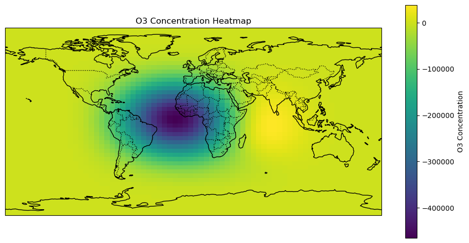
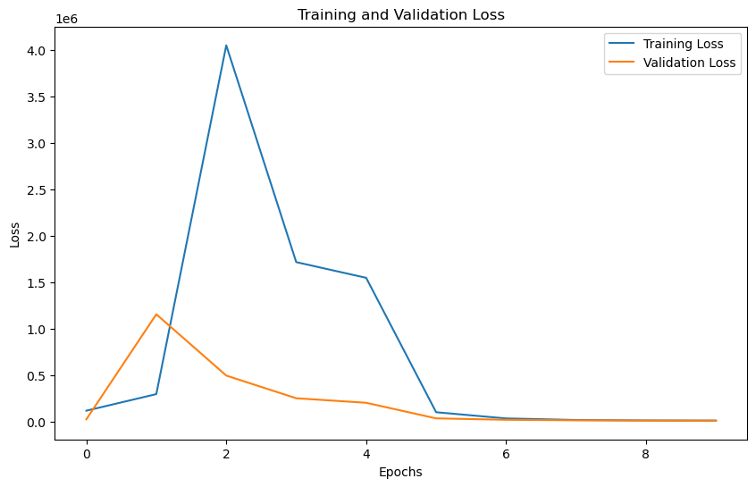

Best to look at this on source mode
## Dense Model 1

 Layer (type)                Output Shape              Param #
=================================================================
 conv2d (Conv2D)             (None, 72, 45, 32)        458784

 max_pooling2d (MaxPooling2D  (None, 36, 22, 32)       0
 )

 conv2d_1 (Conv2D)           (None, 36, 22, 64)        18496

 max_pooling2d_1 (MaxPooling  (None, 18, 11, 64)       0
 2D)

 conv2d_2 (Conv2D)           (None, 18, 11, 128)       73856

 max_pooling2d_2 (MaxPooling  (None, 9, 5, 128)        0
 2D)

 flatten (Flatten)           (None, 5760)              0

 dense (Dense)               (None, 512)               2949632

 dense_1 (Dense)             (None, 136080)            69809040

 reshape (Reshape)           (None, 72, 45, 42)        0

=================================================================
Total params: 73,309,808
Trainable params: 73,309,808
Non-trainable params: 0
_________________________________________________________________
Epoch 1/10
2024-07-11 09:39:38.052519: I tensorflow/stream_executor/cuda/cuda_dnn.cc:384] Loaded cuDNN version 8100
2024-07-11 09:39:39.434094: I tensorflow/stream_executor/cuda/cuda_blas.cc:1614] TensorFloat-32 will be used for the matrix multiplication. This will only be logged once.
9/9 [==============================] - 101s 11s/step - loss: 19800.5723 - val_loss: 19420.9609
Epoch 2/10
9/9 [==============================] - 96s 11s/step - loss: 19508.9707 - val_loss: 19391.1543
Epoch 3/10
9/9 [==============================] - 97s 11s/step - loss: 19495.9980 - val_loss: 19384.3652
Epoch 4/10
9/9 [==============================] - 109s 13s/step - loss: 19474.9336 - val_loss: 19377.6855
Epoch 5/10
9/9 [==============================] - 129s 15s/step - loss: 19454.0039 - val_loss: 19353.5918
Epoch 6/10
9/9 [==============================] - 108s 12s/step - loss: 19389.4805 - val_loss: 19156.5840
Epoch 7/10
9/9 [==============================] - 123s 14s/step - loss: 19056.6641 - val_loss: 18752.8906
Epoch 8/10
9/9 [==============================] - 123s 14s/step - loss: 18585.9785 - val_loss: 18392.7734
Epoch 9/10
9/9 [==============================] - 123s 14s/step - loss: 18274.9570 - val_loss: 18230.0918
Epoch 10/10
9/9 [==============================] - 142s 16s/step - loss: 18148.0781 - val_loss: 18113.2324

Data details:
time = [2005001, 2006150]
lon = [-177.5, 177.5]
lat = [-88, 88]

train validation test split : 60:20:20

Epoch 1/10
12/12 [==============================] - 288s 24s/step - loss: 19865.5918 - val_loss: 19625.7090
Epoch 2/10
12/12 [==============================] - 311s 27s/step - loss: 19632.3848 - val_loss: 19589.3086
Epoch 3/10
12/12 [==============================] - 333s 28s/step - loss: 19462.3418 - val_loss: 19200.5508
Epoch 4/10
12/12 [==============================] - 316s 27s/step - loss: 18947.4355 - val_loss: 18583.7930
Epoch 5/10
12/12 [==============================] - 341s 29s/step - loss: 18458.5859 - val_loss: 18274.0430
Epoch 6/10
12/12 [==============================] - 391s 33s/step - loss: 18245.4570 - val_loss: 18140.1211
Epoch 7/10
12/12 [==============================] - 368s 31s/step - loss: 18127.0078 - val_loss: 18048.1504
Epoch 8/10
12/12 [==============================] - 419s 36s/step - loss: 18052.9824 - val_loss: 17980.1836
Epoch 9/10
12/12 [==============================] - 416s 35s/step - loss: 18007.8027 - val_loss: 17953.4492
Epoch 10/10
12/12 [==============================] - 443s 37s/step - loss: 17984.5117 - val_loss: 17930.3711

time = [2005001, 2008150]
lon = [-177.5, 177.5]
lat = [-88, 88]

Take 3:
Epoch 1/20
2024-07-16 11:21:27.461953: I tensorflow/stream_executor/cuda/cuda_dnn.cc:384] Loaded cuDNN version 8100
2024-07-16 11:21:32.405537: I tensorflow/stream_executor/cuda/cuda_blas.cc:1614] TensorFloat-32 will be used for the matrix multiplication. This will only be logged once.
27/27 [==============================] - 1925s 72s/step - loss: 16452.6992 - val_loss: 16423.7676
Epoch 2/20
27/27 [==============================] - 1968s 74s/step - loss: 16347.4092 - val_loss: 16422.2480
Epoch 3/20
27/27 [==============================] - 2228s 83s/step - loss: 16345.6582 - val_loss: 16421.4199
Epoch 4/20
27/27 [==============================] - 2462s 92s/step - loss: 16331.6943 - val_loss: 16339.6387
Epoch 5/20
27/27 [==============================] - 2728s 102s/step - loss: 16074.0068 - val_loss: 15904.4385
Epoch 6/20
27/27 [==============================] - 2947s 110s/step - loss: 15718.3926 - val_loss: 15664.2520
Epoch 7/20
27/27 [==============================] - 3327s 124s/step - loss: 15597.4600 - val_loss: 15592.5723
Epoch 8/20
27/27 [==============================] - 3752s 139s/step - loss: 15554.7881 - val_loss: 15567.6416
Epoch 9/20
27/27 [==============================] - 3495s 131s/step - loss: 15535.8740 - val_loss: 15553.6113
Epoch 10/20
27/27 [==============================] - 3639s 136s/step - loss: 15521.4580 - val_loss: 15540.9590
Epoch 11/20
27/27 [==============================] - 3819s 143s/step - loss: 15507.3047 - val_loss: 15524.5723
Epoch 12/20
27/27 [==============================] - 3998s 149s/step - loss: 15486.1357 - val_loss: 15500.5645
Epoch 13/20
27/27 [==============================] - 4186s 157s/step - loss: 15463.5195 - val_loss: 15484.1670
Epoch 14/20
27/27 [==============================] - 4306s 161s/step - loss: 15451.3398 - val_loss: 15473.5176
Epoch 15/20
27/27 [==============================] - 4491s 168s/step - loss: 15440.3428 - val_loss: 15465.3906
Epoch 16/20
27/27 [==============================] - 4556s 170s/step - loss: 15435.3301 - val_loss: 15458.7627
Epoch 17/20
27/27 [==============================] - 4740s 178s/step - loss: 15426.0205 - val_loss: 15450.2881
Epoch 18/20
27/27 [==============================] - 5048s 188s/step - loss: 15418.6533 - val_loss: 15443.3633
Epoch 19/20
27/27 [==============================] - 5118s 191s/step - loss: 15410.3340 - val_loss: 15437.3242
Epoch 20/20
27/27 [==============================] - 5118s 192s/step - loss: 15404.3477 - val_loss: 15430.8506
9/9 [==============================] - 1226s 134s/step - loss: 2629629.2500
output of model.evaluate(test_data): 2629629.25

measurements = ['SO2', 'CO', 'H2O', 'HCl', 'HNO3', 'N2O', 'Temperature']
time = [2005001, 2020150]
lon = [-177.5, 177.5]
lat = [-88, 88]

with a 60:20:20 split of train:validation:test

## Dense Model 2

Model: "sequential"
_________________________________________________________________
 Layer (type)                Output Shape              Param #   
=================================================================
 conv2d (Conv2D)             (None, 72, 45, 32)        258080    
                                                                 
 conv2d_1 (Conv2D)           (None, 72, 45, 32)        9248      
                                                                 
 conv2d_2 (Conv2D)           (None, 72, 45, 32)        9248      
                                                                 
 max_pooling2d (MaxPooling2D  (None, 36, 22, 32)       0         
 )                                                               
                                                                 
 conv2d_3 (Conv2D)           (None, 36, 22, 64)        18496     
                                                                 
 conv2d_4 (Conv2D)           (None, 36, 22, 64)        36928     
                                                                 
 conv2d_5 (Conv2D)           (None, 36, 22, 64)        36928     
                                                                 
 max_pooling2d_1 (MaxPooling  (None, 18, 11, 64)       0         
 2D)                                                             
                                                                 
 conv2d_6 (Conv2D)           (None, 18, 11, 128)       73856     
                                                                 
 conv2d_7 (Conv2D)           (None, 18, 11, 128)       147584    
                                                                 
 conv2d_8 (Conv2D)           (None, 18, 11, 128)       147584    
                                                                 
 max_pooling2d_2 (MaxPooling  (None, 9, 5, 128)        0         
 2D)                                                             
                                                                 
 flatten (Flatten)           (None, 5760)              0         
                                                                 
 dense (Dense)               (None, 512)               2949632   
                                                                 
 dense_1 (Dense)             (None, 136080)            69809040  
                                                                 
 reshape (Reshape)           (None, 72, 45, 42)        0         
                                                                 
=================================================================
Total params: 73,496,624
Trainable params: 73,496,624
Non-trainable params: 0

measurements = ['SO2', 'CO', 'H2O', 'HCl', 'HNO3', 'N2O', 'Temperature']
time = [2005001, 2020150]
lon = [-177.5, 177.5]
lat = [-88, 88]

Epoch 1/40
27/27 [==============================] - 1880s 70s/step - loss: 11849.8564 - val_loss: 6748.8701
Epoch 2/40
27/27 [==============================] - 2207s 83s/step - loss: 5832.2183 - val_loss: 5490.7329
Epoch 3/40
27/27 [==============================] - 2497s 94s/step - loss: 5410.8989 - val_loss: 5476.7983
Epoch 4/40
27/27 [==============================] - 2800s 105s/step - loss: 5392.0469 - val_loss: 5474.7319
Epoch 5/40
27/27 [==============================] - 3040s 114s/step - loss: 5389.0718 - val_loss: 5474.9883
Epoch 6/40
27/27 [==============================] - 3336s 124s/step - loss: 5395.1055 - val_loss: 5482.1206
Epoch 7/40
27/27 [==============================] - 3540s 132s/step - loss: 5398.7593 - val_loss: 5481.2007
Epoch 8/40
27/27 [==============================] - 3840s 144s/step - loss: 5394.3936 - val_loss: 5480.7075
Epoch 9/40
27/27 [==============================] - 4126s 155s/step - loss: 5392.5664 - val_loss: 5475.5625
Epoch 10/40
27/27 [==============================] - 4323s 162s/step - loss: 5401.7432 - val_loss: 5475.8047
Epoch 11/40
27/27 [==============================] - 4602s 171s/step - loss: 5393.3506 - val_loss: 5481.7510
Epoch 12/40
27/27 [==============================] - 4833s 181s/step - loss: 5389.5903 - val_loss: 5492.2085
Epoch 13/40
27/27 [==============================] - 5038s 189s/step - loss: 5405.0391 - val_loss: 5479.3423
Epoch 14/40
27/27 [==============================] - 5253s 197s/step - loss: 5396.1182 - val_loss: 5473.1709
Epoch 15/40
27/27 [==============================] - 5700s 213s/step - loss: 5394.5508 - val_loss: 5478.8804
Epoch 16/40
27/27 [==============================] - 5885s 219s/step - loss: 5393.0796 - val_loss: 5475.0278
Epoch 17/40
27/27 [==============================] - 6044s 226s/step - loss: 5388.7817 - val_loss: 5476.5034
Epoch 18/40
27/27 [==============================] - 6199s 232s/step - loss: 5390.8242 - val_loss: 5484.4609
Epoch 19/40
27/27 [==============================] - 6408s 240s/step - loss: 5392.2192 - val_loss: 5488.3794
Epoch 20/40
27/27 [==============================] - 6668s 248s/step - loss: 5390.0483 - val_loss: 5476.7456
Epoch 21/40
27/27 [==============================] - 6900s 258s/step - loss: 5386.8242 - val_loss: 5472.5132
Epoch 22/40
27/27 [==============================] - 7086s 266s/step - loss: 5386.5747 - val_loss: 5484.0122
Epoch 23/40
27/27 [==============================] - 7316s 275s/step - loss: 5391.4204 - val_loss: 5473.7646
Epoch 24/40
27/27 [==============================] - 7597s 282s/step - loss: 5391.6196 - val_loss: 5472.3984
Epoch 25/40
27/27 [==============================] - 7688s 287s/step - loss: 5390.8208 - val_loss: 5471.8213
Epoch 26/40
27/27 [==============================] - 7776s 292s/step - loss: 4983.7534 - val_loss: 4289.7388
Epoch 27/40
27/27 [==============================] - 8023s 308s/step - loss: 3948.3181 - val_loss: 3551.5615
Epoch 28/40
27/27 [==============================] - 8344s 310s/step - loss: 3129.5366 - val_loss: 2263.3994
Epoch 29/40
27/27 [==============================] - 8527s 318s/step - loss: 1656.7079 - val_loss: 1246.0983
Epoch 30/40
27/27 [==============================] - 8517s 319s/step - loss: 1203.0823 - val_loss: 1057.3320
Epoch 31/40
27/27 [==============================] - 9007s 338s/step - loss: 1072.0562 - val_loss: 933.3200
Epoch 32/40
27/27 [==============================] - 9321s 347s/step - loss: 968.0431 - val_loss: 849.5179
Epoch 33/40
27/27 [==============================] - 9533s 356s/step - loss: 872.7200 - val_loss: 730.1677
Epoch 34/40
27/27 [==============================] - 9526s 357s/step - loss: 772.5638 - val_loss: 632.3705
Epoch 35/40
27/27 [==============================] - 10011s 375s/step - loss: 696.6445 - val_loss: 549.7705
Epoch 36/40
27/27 [==============================] - 10205s 392s/step - loss: 647.5262 - val_loss: 525.0259
Epoch 37/40
27/27 [==============================] - 10403s 389s/step - loss: 630.8162 - val_loss: 522.6607
Epoch 38/40
27/27 [==============================] - 10698s 402s/step - loss: 623.5358 - val_loss: 563.0702
Epoch 39/40
27/27 [==============================] - 11235s 418s/step - loss: 619.4492 - val_loss: 500.8445
Epoch 40/40
27/27 [==============================] - 11656s 436s/step - loss: 606.0199 - val_loss: 495.3496

## ConvModel
Model: "sequential"
_________________________________________________________________
 Layer (type)                Output Shape              Param #   
=================================================================
 conv2d (Conv2D)             (None, 72, 45, 32)        458784    
                                                                 
 max_pooling2d (MaxPooling2D  (None, 36, 22, 32)       0         
 )                                                               
                                                                 
 conv2d_1 (Conv2D)           (None, 36, 22, 64)        18496     
                                                                 
 max_pooling2d_1 (MaxPooling  (None, 18, 11, 64)       0         
 2D)                                                             
                                                                 
 conv2d_2 (Conv2D)           (None, 18, 11, 128)       73856     
                                                                 
 max_pooling2d_2 (MaxPooling  (None, 9, 5, 128)        0         
 2D)                                                             
                                                                 
 conv2d_transpose (Conv2DTra  (None, 11, 7, 128)       147584    
 nspose)                                                         
                                                                 
 conv2d_transpose_1 (Conv2DT  (None, 16, 9, 128)       295040    
 ranspose)                                                       
                                                                 
 conv2d_transpose_2 (Conv2DT  (None, 23, 16, 64)       524352    
 ranspose)                                                       
                                                                 
 conv2d_transpose_3 (Conv2DT  (None, 32, 25, 64)       409664    
 ranspose)                                                       
                                                                 
 conv2d_transpose_4 (Conv2DT  (None, 41, 29, 64)       204864    
 ranspose)                                                       
                                                                 
 conv2d_transpose_5 (Conv2DT  (None, 50, 33, 64)       204864    
 ranspose)                                                       
                                                                 
 conv2d_transpose_6 (Conv2DT  (None, 59, 37, 32)       102432    
 ranspose)                                                       
                                                                 
 conv2d_transpose_7 (Conv2DT  (None, 63, 41, 32)       25632     
 ranspose)                                                       
                                                                 
 conv2d_transpose_8 (Conv2DT  (None, 72, 45, 42)       67242     
 ranspose)                                                       
                                                                 
=================================================================
Total params: 2,532,810
Trainable params: 2,532,810
Non-trainable params: 0

Epoch 1/10
13/13 [==============================] - 799s 62s/step - loss: 117238.1172 - val_loss: 24256.4551
Epoch 2/10
13/13 [==============================] - 877s 68s/step - loss: 295746.3750 - val_loss: 1154673.5000
Epoch 3/10
13/13 [==============================] - 1028s 83s/step - loss: 4048701.0000 - val_loss: 495225.7188
Epoch 4/10
13/13 [==============================] - 1121s 88s/step - loss: 1716072.5000 - val_loss: 251105.7656
Epoch 5/10
13/13 [==============================] - 1096s 86s/step - loss: 1546920.6250 - val_loss: 202412.8438
Epoch 6/10
13/13 [==============================] - 1139s 89s/step - loss: 100743.2109 - val_loss: 34606.1094
Epoch 7/10
13/13 [==============================] - 1215s 96s/step - loss: 34090.7305 - val_loss: 19349.8984
Epoch 8/10
13/13 [==============================] - 1274s 100s/step - loss: 17219.1816 - val_loss: 13720.4893
Epoch 9/10
13/13 [==============================] - 1315s 103s/step - loss: 12200.0723 - val_loss: 11152.2871
Epoch 10/10
13/13 [==============================] - 1381s 108s/step - loss: 10789.9600 - val_loss: 10361.7109

measurements = ['SO2', 'CO', 'H2O', 'HCl', 'HNO3', 'N2O', 'Temperature']
time = [2005001, 2012150]
lon = [-177.5, 177.5]
lat = [-88, 88]
s
all the predictions kind of looked like what can be seen below

DenseModel2:
Model: "sequential"
_________________________________________________________________
 Layer (type)                Output Shape              Param #   
=================================================================
 conv2d (Conv2D)             (None, 72, 45, 128)       1032320   
                                                                 
 conv2d_1 (Conv2D)           (None, 72, 45, 128)       147584    
                                                                 
 conv2d_2 (Conv2D)           (None, 72, 45, 128)       147584    
                                                                 
 max_pooling2d (MaxPooling2D  (None, 36, 22, 128)      0         
 )                                                               
                                                                 
 conv2d_3 (Conv2D)           (None, 36, 22, 256)       295168    
                                                                 
 conv2d_4 (Conv2D)           (None, 36, 22, 256)       590080    
                                                                 
 conv2d_5 (Conv2D)           (None, 36, 22, 256)       590080    
                                                                 
 max_pooling2d_1 (MaxPooling  (None, 18, 11, 256)      0         
 2D)                                                             
                                                                 
 conv2d_6 (Conv2D)           (None, 18, 11, 512)       1180160   
                                                                 
 conv2d_7 (Conv2D)           (None, 18, 11, 512)       2359808   
...
Total params: 171,778,576
Trainable params: 171,778,576
Non-trainable params: 0

Did not train

Epoch 1/50
33/33 - 1629s - loss: 16729.8184 - val_loss: 5276.8438 - 1629s/epoch - 49s/step
Epoch 2/50
33/33 - 1596s - loss: 5215.0522 - val_loss: 5160.3555 - 1596s/epoch - 48s/step
Epoch 3/50
33/33 - 1647s - loss: 5102.9224 - val_loss: 5132.1855 - 1647s/epoch - 50s/step
Epoch 4/50
33/33 - 1718s - loss: 5099.1611 - val_loss: 5126.2109 - 1718s/epoch - 52s/step
Epoch 5/50
33/33 - 1787s - loss: 5097.4341 - val_loss: 5129.9062 - 1787s/epoch - 54s/step
Epoch 6/50
33/33 - 1807s - loss: 5093.3652 - val_loss: 5152.7983 - 1807s/epoch - 55s/step
Epoch 7/50
33/33 - 1836s - loss: 5100.1030 - val_loss: 5132.7915 - 1836s/epoch - 56s/step
Epoch 8/50
33/33 - 1852s - loss: 5102.9253 - val_loss: 5129.7861 - 1852s/epoch - 56s/step
Epoch 9/50
33/33 - 1893s - loss: 5095.9316 - val_loss: 5138.2114 - 1893s/epoch - 57s/step
Epoch 10/50
33/33 - 1945s - loss: 5097.2944 - val_loss: 5132.2783 - 1945s/epoch - 59s/step
Epoch 11/50
33/33 - 1989s - loss: 5094.7979 - val_loss: 5131.2256 - 1989s/epoch - 60s/step
Epoch 12/50
33/33 - 2050s - loss: 5094.9580 - val_loss: 5126.7500 - 2050s/epoch - 62s/step
Epoch 13/50
33/33 - 2098s - loss: 5095.8379 - val_loss: 5138.8906 - 2098s/epoch - 64s/step
Epoch 14/50
33/33 - 2145s - loss: 5097.8086 - val_loss: 5131.4688 - 2145s/epoch - 65s/step
Epoch 15/50
33/33 - 2214s - loss: 5095.3550 - val_loss: 5134.7881 - 2214s/epoch - 67s/step
Epoch 16/50
33/33 - 2256s - loss: 5097.0601 - val_loss: 5134.0933 - 2256s/epoch - 68s/step
Epoch 17/50
33/33 - 2362s - loss: 5093.6035 - val_loss: 5126.9009 - 2362s/epoch - 72s/step
Epoch 18/50
33/33 - 2392s - loss: 5094.3477 - val_loss: 5126.7119 - 2392s/epoch - 72s/step
Epoch 19/50
33/33 - 2464s - loss: 5094.5122 - val_loss: 5131.0625 - 2464s/epoch - 75s/step
Epoch 20/50
33/33 - 2552s - loss: 5097.3877 - val_loss: 5130.7075 - 2552s/epoch - 77s/step
Epoch 21/50
33/33 - 2639s - loss: 5099.7480 - val_loss: 5133.8345 - 2639s/epoch - 80s/step
Epoch 22/50
33/33 - 2750s - loss: 5095.4873 - val_loss: 5132.7402 - 2750s/epoch - 83s/step
Epoch 23/50
33/33 - 2842s - loss: 5101.2222 - val_loss: 5136.2798 - 2842s/epoch - 86s/step
Epoch 24/50
33/33 - 2948s - loss: 5093.1167 - val_loss: 5128.4888 - 2948s/epoch - 89s/step
Epoch 25/50
33/33 - 3059s - loss: 5104.8960 - val_loss: 5129.9048 - 3059s/epoch - 93s/step
Epoch 26/50
33/33 - 3157s - loss: 5105.2222 - val_loss: 5140.5620 - 3157s/epoch - 96s/step
Epoch 27/50
33/33 - 3285s - loss: 5097.5649 - val_loss: 5131.1631 - 3285s/epoch - 100s/step
Epoch 28/50
33/33 - 3320s - loss: 5095.9038 - val_loss: 5137.4248 - 3320s/epoch - 101s/step
Epoch 29/50
33/33 - 3464s - loss: 5103.4639 - val_loss: 5130.7661 - 3464s/epoch - 105s/step
Epoch 30/50
33/33 - 3568s - loss: 5100.8979 - val_loss: 5127.8003 - 3568s/epoch - 108s/step
Epoch 31/50
33/33 - 3762s - loss: 5095.7056 - val_loss: 5127.5571 - 3762s/epoch - 114s/step
Epoch 32/50
33/33 - 4045s - loss: 5091.9404 - val_loss: 5130.6436 - 4045s/epoch - 123s/step
Epoch 33/50
33/33 - 4390s - loss: 5096.1035 - val_loss: 5124.6445 - 4390s/epoch - 133s/step
Epoch 34/50
33/33 - 4521s - loss: 5095.3496 - val_loss: 5124.6548 - 4521s/epoch - 137s/step
Epoch 35/50
33/33 - 4565s - loss: 5097.5508 - val_loss: 5126.0366 - 4565s/epoch - 138s/step
Epoch 36/50
33/33 - 4694s - loss: 5105.7480 - val_loss: 5139.7158 - 4694s/epoch - 142s/step
Epoch 37/50
33/33 - 4828s - loss: 5094.7944 - val_loss: 5125.4902 - 4828s/epoch - 146s/step
Epoch 38/50
33/33 - 4926s - loss: 5094.2549 - val_loss: 5131.3525 - 4926s/epoch - 149s/step
Epoch 39/50
33/33 - 5162s - loss: 5097.6416 - val_loss: 5126.5142 - 5162s/epoch - 156s/step
Epoch 40/50
33/33 - 5364s - loss: 5091.1479 - val_loss: 5135.3979 - 5364s/epoch - 163s/step
Epoch 41/50
33/33 - 5643s - loss: 5097.6895 - val_loss: 5128.0684 - 5643s/epoch - 171s/step
Epoch 42/50
33/33 - 5789s - loss: 5106.4824 - val_loss: 5144.9053 - 5789s/epoch - 175s/step
Epoch 43/50
33/33 - 5216s - loss: 5094.7402 - val_loss: 5123.2017 - 5216s/epoch - 158s/step
Epoch 44/50
33/33 - 5402s - loss: 5091.9624 - val_loss: 5129.4756 - 5402s/epoch - 164s/step
Epoch 45/50
33/33 - 5620s - loss: 5093.4688 - val_loss: 5129.1968 - 5620s/epoch - 170s/step
Epoch 46/50
33/33 - 5769s - loss: 5090.2236 - val_loss: 5123.7520 - 5769s/epoch - 175s/step
Epoch 47/50
33/33 - 5943s - loss: 5097.4395 - val_loss: 5124.8120 - 5943s/epoch - 180s/step
Epoch 48/50
33/33 - 6126s - loss: 5090.7373 - val_loss: 5132.0327 - 6126s/epoch - 186s/step
Epoch 49/50
33/33 - 6283s - loss: 5090.6748 - val_loss: 5128.2056 - 6283s/epoch - 190s/step
Epoch 50/50
33/33 - 6602s - loss: 5097.7314 - val_loss: 5123.5991 - 6602s/epoch - 200s/step

Dropout + l2regularizer with an l2_lambda value of 0.001
Model: "sequential"
_________________________________________________________________
 Layer (type)                Output Shape              Param #   
=================================================================
 conv2d (Conv2D)             (None, 72, 45, 128)       1032320   
                                                                 
 conv2d_1 (Conv2D)           (None, 72, 45, 128)       147584    
                                                                 
 conv2d_2 (Conv2D)           (None, 72, 45, 128)       147584    
                                                                 
 max_pooling2d (MaxPooling2D  (None, 36, 22, 128)      0         
 )                                                               
                                                                 
 dropout (Dropout)           (None, 36, 22, 128)       0         
                                                                 
 conv2d_3 (Conv2D)           (None, 36, 22, 256)       295168    
                                                                 
 conv2d_4 (Conv2D)           (None, 36, 22, 256)       590080    
                                                                 
 conv2d_5 (Conv2D)           (None, 36, 22, 256)       590080    
                                                                 
 max_pooling2d_1 (MaxPooling  (None, 18, 11, 256)      0         
 2D)                                                             
                                                                 
 dropout_1 (Dropout)         (None, 18, 11, 256)       0         
                                                                 
 conv2d_6 (Conv2D)           (None, 18, 11, 512)       1180160   
                                                                 
 conv2d_7 (Conv2D)           (None, 18, 11, 512)       2359808   
                                                                 
 conv2d_8 (Conv2D)           (None, 18, 11, 512)       2359808   
                                                                 
 max_pooling2d_2 (MaxPooling  (None, 9, 5, 512)        0         
 2D)                                                             
                                                                 
 dropout_2 (Dropout)         (None, 9, 5, 512)         0         
                                                                 
 flatten (Flatten)           (None, 23040)             0         
                                                                 
 dense (Dense)               (None, 1024)              23593984  
                                                                 
 dropout_3 (Dropout)         (None, 1024)              0         
                                                                 
 dense_1 (Dense)             (None, 136080)            139482000 
                                                                 
 reshape (Reshape)           (None, 72, 45, 42)        0         
                                                                 
=================================================================
Total params: 171,778,576
Trainable params: 171,778,576
Non-trainable params: 0